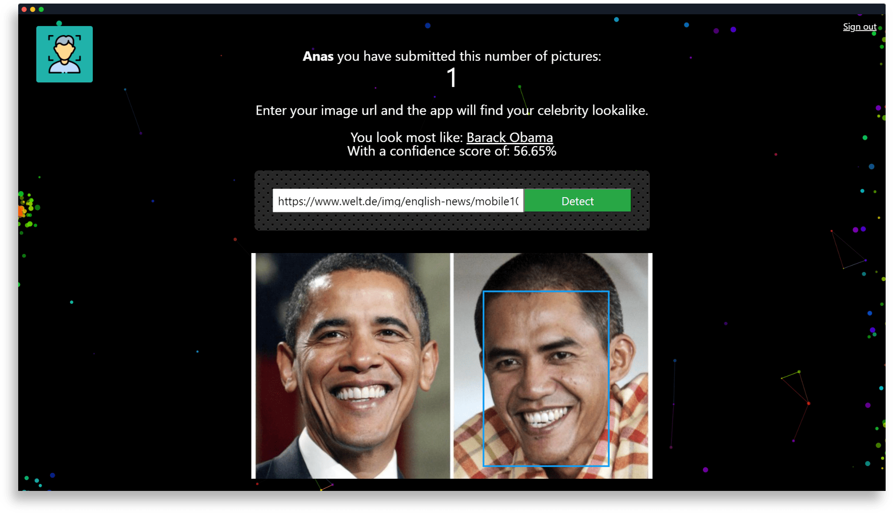

# Celebrity Lookalike Web App

## Overview
Have you ever wondered which famous celebrity you look like the most? Well, this app will help you find just that! Simply give it a URL to an image of yourself and let the app find your closest celebrity lookalike. It even gives you a confidence score! Try it out [here](https://mohamedirfansh.github.io/Celebrity-Lookalike-WebApp/)!

Simply sign up for a free account and submit a URL to an image of yourself to find you celebrity lookalike!



## Getting Started

### Prerequisites
To get a copy of the project up and running on your local machine, ensure that you have the following installed:

- Node.js (v12.18.3 or newer although older versions should still work)
- NPM (v6.14.6 or newer although older versions should still work)
- PostgreSQL (v13.1 or newer although older versions should still work)

### Installing and running
Clone this repo with:
```
git clone https://github.com/mohamedirfansh/Celebrity-Lookalike-WebApp.git
```
Then, move the folder `backend-code` to a different directory and rename it to `Celebrity-Lookalike-WebApp-api`. In the frontend folder `Celebrity-Lookalike-WebApp`, run the following in your terminal:
```
npm install
npm run
```

Create your own local database in PostgreSQL. You will also need your own API key from Clarifai. You can grab one [here](https://www.clarifai.com/). Then, in the backend folder `Celebrity-Lookalike-WebApp-api`, fill in the required values in the .env file.
```
API_KEY= 'Your API key'
USER= 'Your local PostgreSQL username'
PASSWORD= 'Your local PostgreSQL password'
DATABASE_NAME= 'Your local database name'
```
Ensure that PostgreSQL is running in your localhost. Then, run the following in your terminal to start the backend development server:
```
npm install
npm run
```

## Built With
- [React](https://reactjs.org/)
- [Node.js](https://nodejs.org/)
- [Express](https://expressjs.com/)
- [PostgreSQL](https://www.postgresql.org/)
---
> This project was built and submitted for the MLH Holiday Hacks 2020. View submission [here](https://devpost.com/software/celebrity-lookalike).